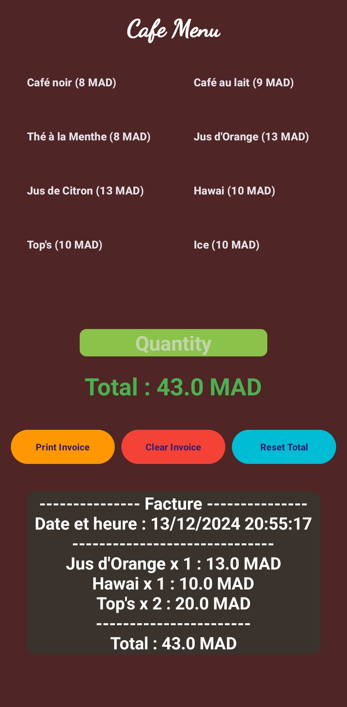
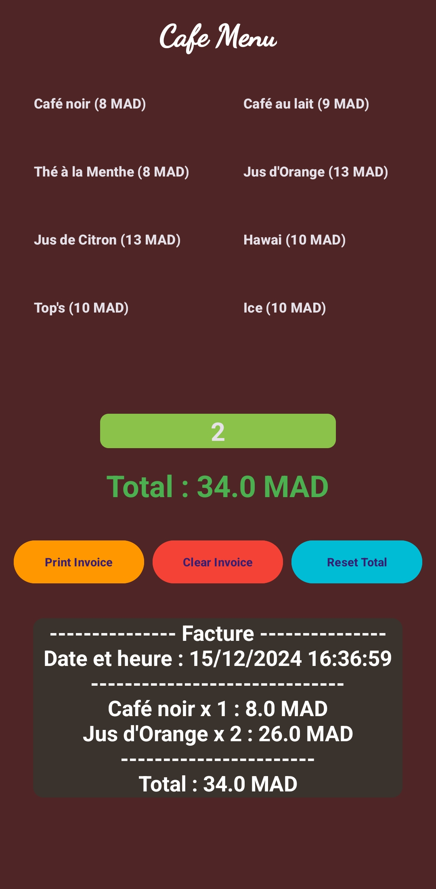

# CafeApp - Android Cafe Management Application

This Android application, CafeApp, simplifies cafe menu management and order processing. It provides a user-friendly interface for managing menu items, tracking orders, and generating invoices.

## Features

*   **Menu Display:** Displays menu items in a clear grid layout with names and prices.
*   **Order Management:** Allows users to select items and specify quantities.
*   **Real-time Total Calculation:** Calculates and displays the total price of the current order.
*   **Invoice Generation:** Generates detailed invoices with date, time, ordered items, quantities, and total cost.
*   **Order Clearing:** Provides functionality to clear the current order and reset the total.

## Screenshots




## Technologies Used

*   Java
*   Android SDK
*   Android Studio

## Setup and Installation
$

* Android Studio installed (Download from https://developer.android.com/)
* An Android emulator or physical device

**Steps:**

1.  Clone the repository:

    ```bash
    git clone
    ```

2.  Open the project in Android Studio.
3.  Build and run the application on an Android emulator or physical device.

## Usage

1.  Launch the application.
2.  View the menu items displayed in the grid.
3.  Enter the desired quantity in the quantity field.
4.  Tap on a menu item to add it to the order.
5.  The total price will be updated in real-time.
6.  Tap the "Imprimer Facture" (Print Invoice) button to generate a detailed invoice.
7.  Use the "Reinitialiser Total" (Reset Total) button to clear the order and reset the total.
8.  Use the "viderFacture" (Clear Invoice) button to clear the invoice display.

## Code Structure

*   `MainActivity.java`: Contains the main application logic, including menu display, order management, and invoice generation.
*   `activity_main.xml`: Defines the user interface layout.
